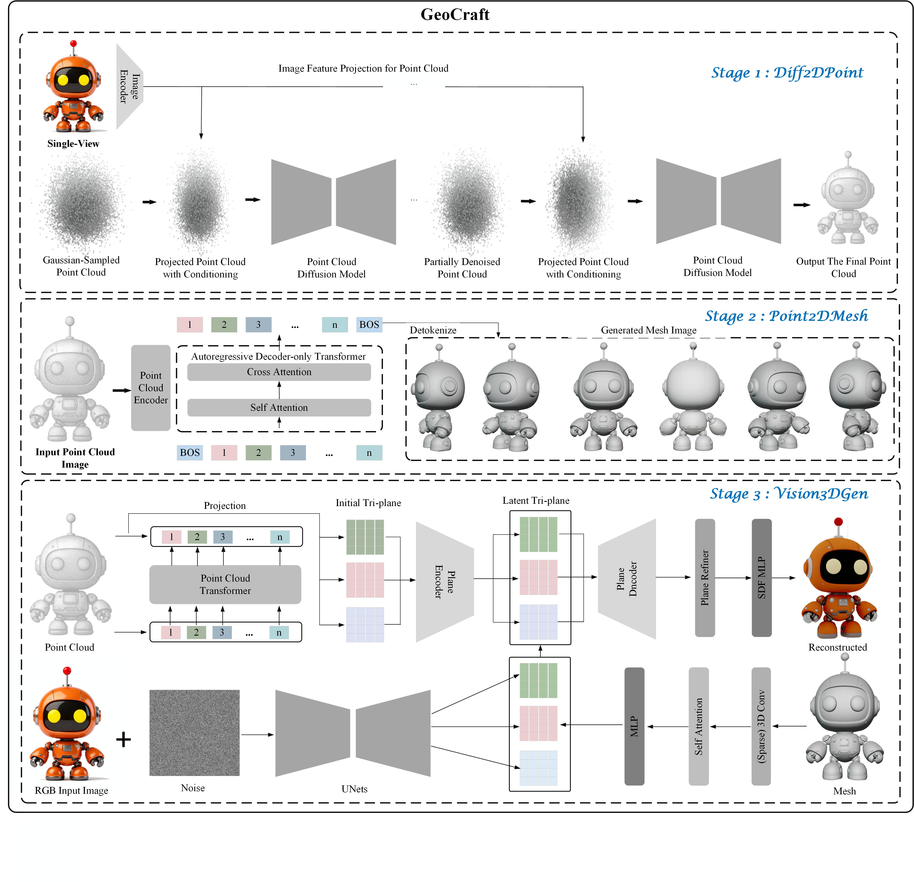
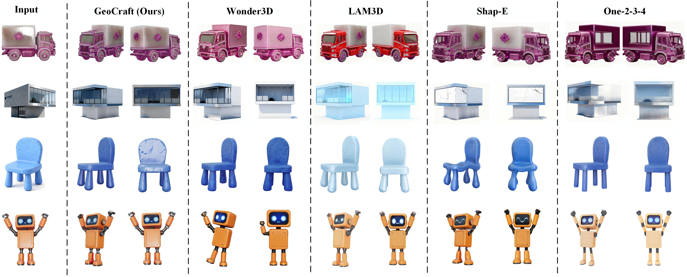

# GeoCraft: A Diffusion Model-Based 3D Reconstruction Method Driven by Image and Point Cloud Fusion

## Abstract

With the rapid development of technologies like virtual reality (VR), autonomous driving, and digital twins, the demand for high-precision and realistic multimodal 3D reconstruction has surged. This technology has become a core research focus in computer vision and graphics due to its ability to integrate multi-source data, such as 2D images and point clouds. However, existing methods face challenges such as geometric inconsistency in single-view reconstruction, poor point cloud-to-mesh conversion, and insufficient multimodal feature fusion, limiting their practical application.
To address these issues, this paper proposes GeoCraft, a multimodal 3D reconstruction method that generates high-precision 3D models from 2D images through three collaborative stages: Diff2DPoint, Point2DMesh, and Vision3DGen. Specifically, Diff2DPoint generates an initial point cloud with geometric alignment using a diffusion model and projection feature fusion; Point2DMesh converts the point cloud into a high-quality mesh using an autoregressive decoder-only Transformer and Direct Preference Optimization (DPO); Vision3DGen creates high-fidelity 3D objects through multimodal feature alignment.
Experiments on the Google Scanned Objects (GSO) and Pix3D datasets show that GeoCraft excels in key metrics. On the GSO dataset, its CMMD is 2.810 and FID\textsubscript{CLIP} is 26.420; on Pix3D, CMMD is 3.020 and FID\textsubscript{CLIP} is 27.030. GeoCraft significantly outperforms existing 3D reconstruction methods and also demonstrates advantages in computational efficiency, effectively solving key challenges in 3D reconstruction.





# Project Setup and Requirements

To set up the environment for this project, follow the steps below:


The first step is to create a Conda environment specifically for this project. This helps to ensure that the project dependencies are isolated and do not interfere with other Python projects or system-wide libraries.

You can create a Conda environment named `GeoCraft` by running the following command in your terminal or command prompt:

```bash
conda env create -f environment.yaml
conda activate GeoCraft
```


## Testing

To test and generate predictions from the trained **CCMIM** model, you can use the `test.py` and `inference.py` scripts. The `test.py` script allows you to evaluate the model on a dataset, while `inference.py` lets you test the model on individual images.

### 1. Running Inference on a Test Dataset

To run inference on a test dataset, use the following command:

```bash
python test.py \
  --ckpt ../Training/runs/best_ccmim_model.pth \
  --dataset RDD2022 \
  --test_data_dir ../Testing/test_datasets/RDD2022_test \
  --outdir ../Quantitative_Results/result_tables \
  --batch_size 32 \
  --size 640 \
  --conf_thres 0.5 \
  --iou_thres 0.5 \
  --seed 123
```

### 2. Running Inference on a Single Image

To run inference on a single image and generate the visualized detection result, use the following command:
```bash
python inference.py \
  --ckpt ../Training/runs/best_ccmim_model.pth \
  --image_path ../Testing/test_datasets/sample_concrete_crack.jpg \
  --outdir ../Testing/inference_results \
  --size 640 \
  --conf_thres 0.5
```

## Training CCMIM
To train a new CCMIM model on a dataset, you can use the train.py script. Below is an example of how to run the training process.
```bash
python train.py \
  --model ccmim \
  --train_data_dir ../Training/datasets/RDD2022/train \
  --val_data_dir ../Training/datasets/RDD2022/val \
  --outdir ../Training/runs/ccmim_rdd2022_train \
  --ckpt_init None \
  --batch_size 32 \
  --size 640 \
  --epochs 150 \
  --lr 0.01 \
  --lr_decay_steps 50 \
  --optimizer sgd \
  --weight_decay 0.0005 \
  --momentum 0.937 \
  --seed 123
```


## Reuslts



