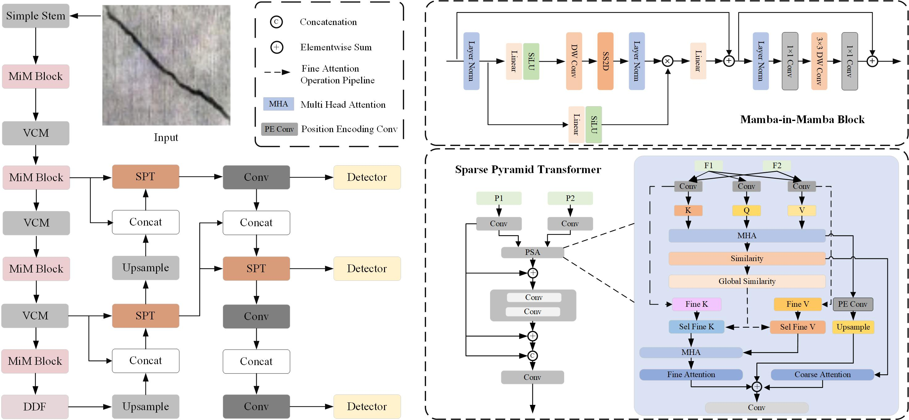
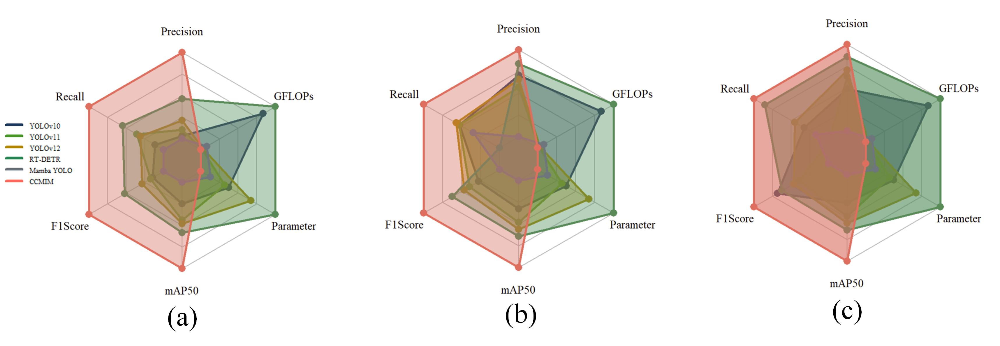

# CCMIM: Optimizing Concrete Defect Detection through State-Space Modeling and Dynamic Feature Fusion

## Abstract

Concrete defect detection is crucial to the safety, reliability, and durability of structures. For CNN models, it is impossible to obtain all information at different scales and complex backgrounds, nor can it capture all contexts globally. Transformer-based models are computationally intensive, making it difficult to generalize to real-time detection tasks.
To address these issues, we propose a novel end-to-end concrete crack detection framework: **Concrete Crack Mamba-in-Mamba (CCMIM)**. Specifically, we introduce the **Mamba-In-Mamba (MiM)** module to capture long-range dependencies and global context to improve the concrete defect detection capability based on hierarchical data flow. In addition, this paper also proposes the **Dynamic Dual Fusion (DDF)** module, which enhances the robustness and adaptability of the model and achieves smooth multi-scale fusion by dynamically changing the feature representation.
To reduce the computational cost and maintain spatial information, we propose the **Sparse Pyramid Transformer (SPT)** module. This module reduces the computation and improves the inference speed by selecting tokens level by level (from coarse to fine) and sharing attention parameters, but does not sacrifice accuracy.
Experimental results show that the CCMIM model outperforms traditional methods as well as YOLO- and Transformer-based models in small crack detection across multiple datasets. Specifically, on the **RDD2022**, **SDNET2018**, and **CCCD** datasets, the accuracy reached **89.2%**, **85.2%**, and **79.3%**, respectively, while the **mAP50** reached **88.1%**, **87.8%**, and **79.2%**.
In summary, the CCMIM model provides an effective solution for concrete defect detection.





# Project Setup and Requirements

To set up the environment for this project, follow the steps below:


The first step is to create a Conda environment specifically for this project. This helps to ensure that the project dependencies are isolated and do not interfere with other Python projects or system-wide libraries.

You can create a Conda environment named `CCMIM` by running the following command in your terminal or command prompt:

```bash
conda env create -f environment.yaml
conda activate CCMIM
```
## Data Availability

The data used in this study are from publicly available datasets. The datasets used are as follows:

1. **RDD2022 Dataset**: Accessible via the open-source repository at [https://github.com/sekilab/RoadDamageDetector](https://github.com/sekilab/RoadDamageDetector), which provides complete image files and corresponding annotation data for road defect detection tasks.

2. **SDNET2018 Dataset**: Available for download from the Utah State University Digital Commons at [https://digitalcommons.usu.edu/all_datasets/48/](https://digitalcommons.usu.edu/all_datasets/48/), including all 56,000 concrete bridge deck images and detailed metadata (e.g., imaging conditions, crack labels).

3. **CCCD Dataset**: Hosted on the Virginia Tech University Libraries Data Repository, accessible at [https://data.lib.vt.edu/articles/dataset/Concrete_Crack_Conglomerate_Dataset/16625056](https://data.lib.vt.edu/articles/dataset/Concrete_Crack_Conglomerate_Dataset/16625056), with full access to the ~3,500 building concrete crack images and standard annotation files compatible with common deep learning frameworks.


## Testing

To test and generate predictions from the trained **CCMIM** model, you can use the `test.py` and `inference.py` scripts. The `test.py` script allows you to evaluate the model on a dataset, while `inference.py` lets you test the model on individual images.

### 1. Running Inference on a Test Dataset

To run inference on a test dataset, use the following command:

```bash
python test.py \
  --ckpt ../Training/runs/best_ccmim_model.pth \
  --dataset RDD2022 \
  --test_data_dir ../Testing/test_datasets/RDD2022_test \
  --outdir ../Quantitative_Results/result_tables \
  --batch_size 32 \
  --size 640 \
  --conf_thres 0.5 \
  --iou_thres 0.5 \
  --seed 123
```

### 2. Running Inference on a Single Image

To run inference on a single image and generate the visualized detection result, use the following command:
```bash
python inference.py \
  --ckpt ../Training/runs/best_ccmim_model.pth \
  --image_path ../Testing/test_datasets/sample_concrete_crack.jpg \
  --outdir ../Testing/inference_results \
  --size 640 \
  --conf_thres 0.5
```

## Training CCMIM
To train a new CCMIM model on a dataset, you can use the train.py script. Below is an example of how to run the training process.
```bash
python train.py \
  --model ccmim \
  --train_data_dir ../Training/datasets/RDD2022/train \
  --val_data_dir ../Training/datasets/RDD2022/val \
  --outdir ../Training/runs/ccmim_rdd2022_train \
  --ckpt_init None \
  --batch_size 32 \
  --size 640 \
  --epochs 150 \
  --lr 0.01 \
  --lr_decay_steps 50 \
  --optimizer sgd \
  --weight_decay 0.0005 \
  --momentum 0.937 \
  --seed 123
```


## Reuslts



